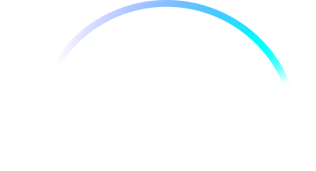
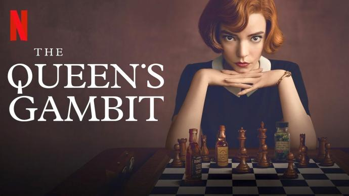
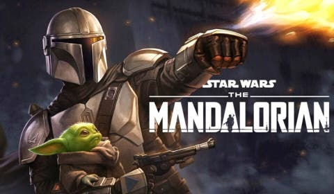
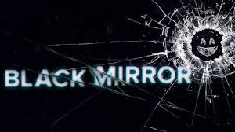
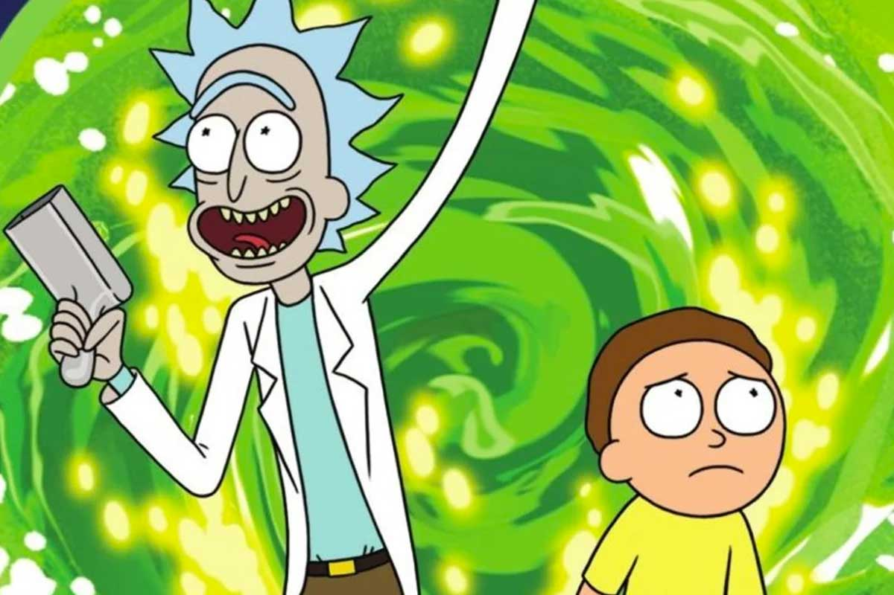
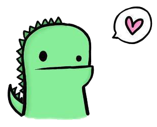

<!DOCTYPE html>
<html lang="es">
    <link rel="preconnect" href="https://fonts.gstatic.com">
<link href="https://fonts.googleapis.com/css2?family=Londrina+Solid:wght@900&display=swap" rel="stylesheet">
    <link rel="preconnect" href="https://fonts.gstatic.com">
<link href="https://fonts.googleapis.com/css2?family=Josefin+Sans:ital,wght@1,300&display=swap" rel="stylesheet">
    <link rel="preconnect" href="https://fonts.gstatic.com">
<link href="https://fonts.googleapis.com/css2?family=Roboto+Mono&display=swap" rel="stylesheet">
<head> 

     
    <title> Mi primer sitio web </title>
    

</head>
<body> 

    <h1><strong>RECOMENDANDO SERIES</h1></strong>
    
    

        

      <h4> Tabla de Contenido</h4>
    <table>
        <thead>
            <tr> 
                <th><h3>Serie</h3></th>
                <th><h3>Género</h3></th>
                <th><h3>Temporadas</h3></th>
                <th><h3>¿Dónde puedo verla?</h3></th>
            </tr>
        </thead>
        <tbody>
            <tr>
              <td> <a href="#dama">Gambito de dama</a></td>
                <td>Drama</td>
                <td>1</td>
                <td>Netflix</td>
            </tr>
            <tr>
                <td> <a href="#mando">The Mandalorian</a></td>
                <td>Space western</td>
                <td>2</td>
                <td>Disney Plus</td>
            </tr>
            <td> <a href="#miro">Black Mirror</a></td>
                <td>Ciencia Ficcion</td>
                <td>1</td>
                <td>Netflix</td>
             </tr>
             <tr>
                <td> <a href="#morti">Rick and Morty</a></td>
                <td>Comedia animada</td>
                <td>4</td>
                <td>Netflix</td>
             </tr>
             <tr>
                <td><a href="#bad">Breaking Bad</a></td>
                <td>Drama/Crimen</td>
                <td>5</td>
                <td>Netflix</td>
             </tr>
        </tbody>
    </table>

 

    
Hoy quiero recomendarte 5 series, no tiene orden alguno, <strong>ninguna es mejor</strong> que otras, simplemente te mostraré 5 series que no te puedes perder si como yo, tambien eres fantico de las series

     <ul>
         <h2 id="dama"> <li>The Queens Gambit </li></h2>
         
         
 <strong>Género:</strong>Drama

         
<strong>Número de Episodios:</strong> 7 

         
 <strong>Año de Lanzamiento:</strong>2020

         
 Gambito de dama es una miniserie, que esta basada en el libro del mismo nombre, fue lanzada por la plataforma de Netflix y cuenta con las actuaciones de Anya-taylor Joy o de Thomas Brodie-Sangster.Se trata de una chica prodijio quien se convierte en la mejor jugadora de ajedrez, la vemos afrontar distintos problemas como su estadia en el orfanato,el consumo de drogas e intensos campeonatos de ajedrez en los que conoce a grandes amigos y a sus futuros rivales. Esta miniserie, es muy entretenida, te atrapa desde el primer momento, lo mejor que tiene aparte de la actuaciones es la manera como representan las jugadas de ajedrez. Gracias a esta producción las nuevas generaciones estan queriendo jugar ajedrez. 

    
         <h2 id="mando"><li> The mandalorian</h2></li>

 <strong>Género:</strong>Space western

<strong>Número de Episodios:</strong> 16

 <strong>Año de Lanzamiento:</strong>2019

 The mandalorian, es una serie que transcurre en el universo de las películas de star wars fue estrenada en la plataforma de disney+. Nos cuenta la historia de un Mandaloriano, un cazarecompensas que viaja por toda la galaxia, en uno de sus trabajos conoce a un bebé de la misma raza de yoda, el entrenador de luke skywalker en la saga de las peliculas de star wars, el madaloriano tiene que llevarlo con los de su familia y en el viaje se encuentra con distintos enemigos que se quieren llevar al bebé. Lo que le resalto  a esta serie, es que no necesitas ser un gran conocedor del universo de star wars para ponder disfrutar esta serie.

        <h2 id="miro"> <li> Black Mirror</h2></li>
        
        
 <strong>Género:</strong>ciencia Ficción

<strong>Número de Episodios:</strong> 22

 <strong>Año de Lanzamiento:</strong>2011

     
Black mirror es una serie antalógica que trata de un futuro y/o presente distopico en el que el ser humano crea una dependencia tecnologica al punto de que este no puede vivir si esta, ningun episodio esta conectado con el otro, cada episodio funciona por separado, por lo que cada episodio tiene su propia trama

     <h2 id="morti"> <li> Rick and Morty</h2></li>
        
        
 <strong>Género:</strong>Comedia animada,Aventura

<strong>Número de Episodios:</strong> 41

 <strong>Año de Lanzamiento:</strong>2013

    
 Rick and Morty, es una serie animada estadounidense, que nos muestra las desaventuras intergalacticas de un cientifico excentrico y su  no tan brillante e influenciable nieto adolescente. Esta es una serie creada principalmente para un publico adulto, ya que trata temas fuertes (en algunos casos) con un vocabulario un poco soez, que muchas veces le agregan a la serie mas comedia y satira haciendola entretenida de ver. En colombia la puedes ver las cuatro temporadas por la plataforma de Netflix. 

    <h2 id="bad"> <li> Breaking Bad</h2></li>
    
    
 <strong>Género:</strong>Drama y crimen

<strong>Número de Episodios:</strong> 62

 <strong>Año de Lanzamiento:</strong>2008

 Breaking bad, es una serie que sucede en Alburquerque, Nuevo Mexico, su protagonista Walter White es un profesor de quimica, quien tras ser diagnosticado de cancer de pulmon, decide dedicarse a elaborar y vender metanfetamina para asegurar el futuro economico de su familia. En este negocio trabaja con un exalumno Jesse Pickman, con quien logra hacerse conocido en el amplio mundo de las drogas.
    </ul>
    <h4> Gracias por ver</h4>
    

</body>

</html>
